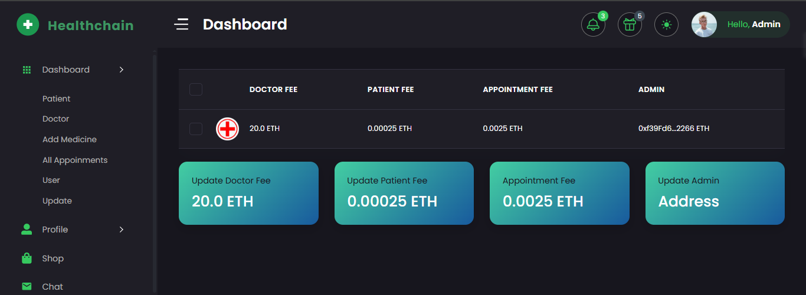
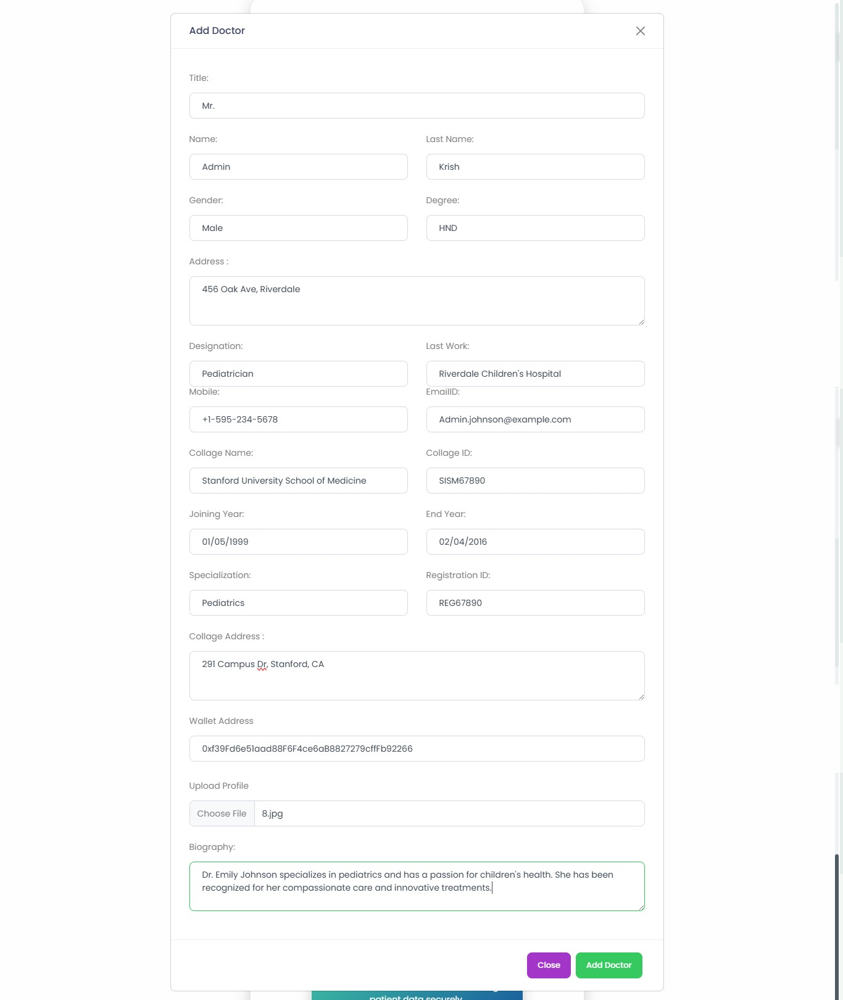
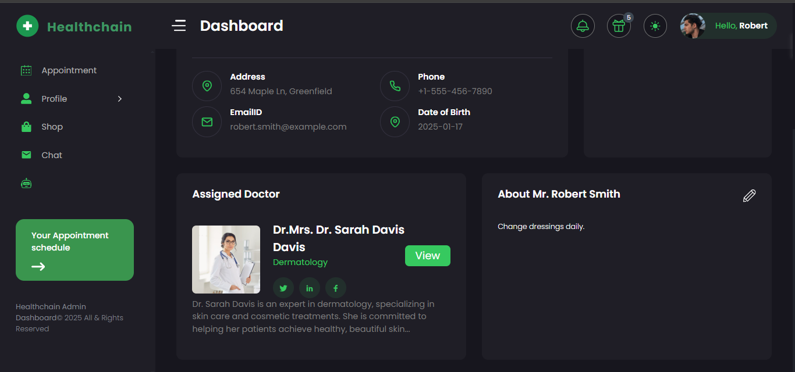
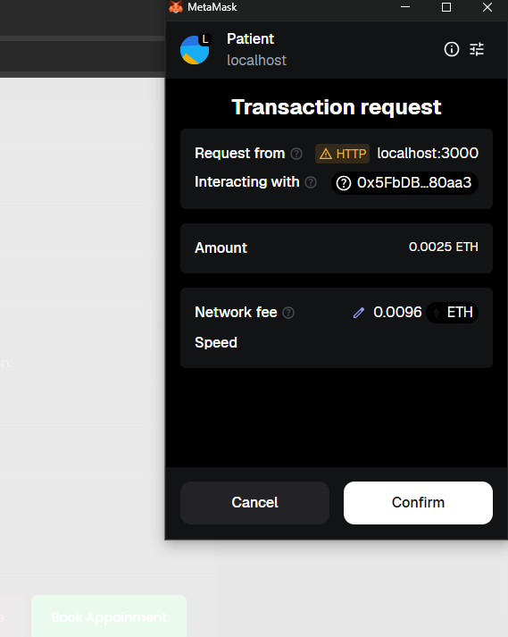
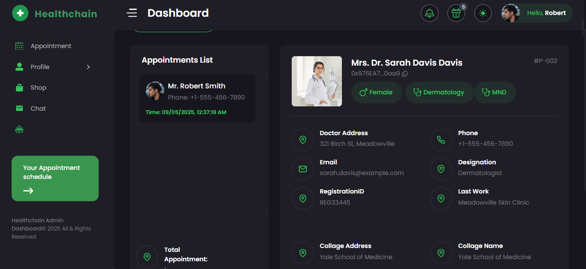

# 🏥 blockchain-health-record

> A decentralized Electronic Health Record (EHR) system built on Ethereum giving patients full ownership of their medical data while enabling secure, permissioned access for doctors and administrators.

---

## 📋 Table of Contents

- [Overview](#overview)
- [Tech Stack](#tech-stack)
- [System Roles](#system-roles)
- [Screenshots](#screenshots)
- [Prerequisites](#prerequisites)
- [Installation & Setup](#installation--setup)
- [Running the Project](#running-the-project)
- [Smart Contract Deployment](#smart-contract-deployment)
- [MetaMask Configuration](#metamask-configuration)
- [Project Structure](#project-structure)
- [Contributing](#contributing)
- [License](#license)

---

## Overview

**blockchain-health-record** leverages Ethereum smart contracts to store, manage, and share health records in a transparent, tamper-proof, and patient-controlled manner. All data access is governed by on-chain permissions — no centralised authority can read or modify records without explicit consent.

Key features:
- Patient-controlled access grants and revocations
- Doctor-initiated record creation and updates
- Admin management of registered users
- Full audit trail stored on-chain
- Local development via Hardhat + Ganache + MetaMask

---

## Tech Stack

| Layer | Technology |
|---|---|
| Blockchain Runtime | [Hardhat](https://hardhat.org/) (local Ethereum node) |
| Local Blockchain GUI | [Ganache](https://trufflesuite.com/ganache/) *(optional alternative to `npx hardhat node`)* |
| Smart Contracts | Solidity |
| Wallet | MetaMask (Chrome Extension) |
| Frontend | React.js |
| Web3 Library | Ethers.js |
| Runtime | Node.js `v18.19.0` |
| Package Manager | npm `10.2.3` |

---

## System Roles

| Role | Capabilities |
|---|---|
| **Patient** | View own records, grant/revoke doctor access |
| **Doctor** | Create and update records for authorised patients |
| **Admin** | Register patients and doctors, manage system users |

---

## Screenshots
 
### 01. Admin Dashboard

> Admin view for registering new patients and doctors, and managing system users.
 
---
 
### 02. Register Patient Form

> Admin fills in patient details. On submission, the record is written to the smart contract.
 
---
 
### 03. Register Doctor Form

> Admin registers a new doctor with their Ethereum wallet address as their on-chain identity.
 
---
 
### 04. Patient Dashboard

> Patients can view their full health record history and manage which doctors have access.
 
---
 
### 05. Grant / Revoke Access

> Patient grants or revokes a doctor's permission to view or update their records.
 
---
 
### 06. Doctor Dashboard

> Doctor sees the list of patients who have granted access and can view or update their records.
 
---
 
### 07. Add / Update Health Record Form

> Doctor submits a new health record entry for a patient. The transaction is signed via MetaMask and written on-chain.
 
---

## Prerequisites

Ensure the following are installed before proceeding.

### Node.js & npm

```bash
node --version   # must be v18.19.0
npm --version    # must be 10.2.3
```

If you need to install the correct version, use [nvm](https://github.com/nvm-sh/nvm):

```bash
nvm install 18.19.0
nvm use 18.19.0
```

### MetaMask Chrome Extension

Install MetaMask from the [Chrome Web Store](https://chrome.google.com/webstore/detail/metamask/nkbihfbeogaeaoehlefnkodbefgpgknn).

> MetaMask is required to sign transactions and interact with the local blockchain.

### Ganache *(optional)*

Ganache is a GUI-based local Ethereum blockchain — a visual alternative to `npx hardhat node`.

- Download from [https://trufflesuite.com/ganache/](https://trufflesuite.com/ganache/)
- Or install the CLI version:

```bash
npm install -g ganache
```

---

## Installation & Setup

### 1. Clone the Repository

```bash
git clone https://github.com/your-username/blockchain-health-record.git
cd blockchain-health-record
```

### 2. Install Dependencies

```bash
npm install
```

### 3. Install Hardhat (if not already installed globally)

```bash
npm install --save-dev hardhat
```

---

## Running the Project

You can run a local blockchain using either **Hardhat** or **Ganache**. Both work with this project — choose one.

---

### Option A — Hardhat Local Node

Open a terminal and run:

```bash
npx hardhat node
```

This starts a local Ethereum JSON-RPC server at `http://127.0.0.1:8545/` and prints 20 test accounts with pre-funded ETH.

```
Started HTTP and WebSocket JSON-RPC server at http://127.0.0.1:8545/

Accounts
========
Account #0: 0xf39Fd6e51aad88F6F4ce6aB8827279cffFb92266 (10000 ETH)
Private Key: 0xac0974bec39a17e36ba4a6b4d238ff944bacb478cbed5efcae784d7bf4f2ff80

Account #1: 0x70997970C51812dc3A010C7d01b50e0d17dc79C8 (10000 ETH)
Private Key: 0x59c6995e998f97a5a0044966f0945389dc9e86dae88c7a8412f4603b6b78690d
```

> ⚠️ Keep this terminal running in the background throughout development.

---

### Option B — Ganache GUI

1. Open the Ganache application
2. Click **Quickstart Ethereum**
3. Ganache starts a local blockchain on `http://127.0.0.1:7545` with 10 pre-funded accounts
4. Click the 🔑 key icon next to any account to copy its private key for MetaMask import
5. Update `hardhat.config.js` to add the Ganache network:

```js
networks: {
  ganache: {
    url: "http://127.0.0.1:7545",
    chainId: 1337,
  }
}
```

### Option B — Ganache CLI

```bash
ganache --port 7545 --chainId 1337
```

---

### Start the Frontend

In a new terminal (with your chosen local node running):

```bash
npm start
```

The app will be available at `http://localhost:3000`.

---

## Smart Contract Deployment

### Deploy to Hardhat

```bash
npx hardhat run scripts/deploy.js --network localhost
```

### Deploy to Ganache

```bash
npx hardhat run scripts/deploy.js --network ganache
```

After deployment, the contract address will be printed in the console. Copy it into your `.env` file:

```env
# Hardhat
REACT_APP_CONTRACT_ADDRESS=0xYourHardhatDeployedAddress

# Ganache (use this instead if running Ganache)
# REACT_APP_CONTRACT_ADDRESS=0xYourGanacheDeployedAddress
```

To run contract tests:

```bash
npx hardhat test
```

---

## MetaMask Configuration

Connect MetaMask to your local blockchain node.

### Network Settings

1. Open MetaMask → click the **network dropdown** → **Add Network** → **Add a network manually**
2. Fill in the values for your chosen local network:

| Field | Hardhat | Ganache |
|---|---|---|
| Network Name | `Hardhat Local` | `Ganache Local` |
| New RPC URL | `http://127.0.0.1:8545` | `http://127.0.0.1:7545` |
| Chain ID | `31337` | `1337` |
| Currency Symbol | `ETH` | `ETH` |
| Block Explorer URL | *(leave blank)* | *(leave blank)* |

3. Click **Save** and switch to your local network.

### Import a Test Account

**From Hardhat:** copy a private key printed by `npx hardhat node`

**From Ganache:** click the 🔑 key icon next to any account in the Ganache UI

Then in MetaMask:
1. Click your account icon → **Import Account**
2. Paste the private key and click **Import**
3. The account loads with test ETH

> 💡 Use different accounts to simulate different roles — **Account #0** as Admin, **Account #1** as Doctor, **Account #2** as Patient.

> ⚠️ These keys are for local development only. Never use them on Mainnet or any real network.

---

## Troubleshooting

**Nonce too high / transaction fails after restarting the node**
> MetaMask → Settings → Advanced → **Clear activity and nonce data**. Do this every time you restart Hardhat or Ganache.

**`ECONNREFUSED 127.0.0.1:8545`**
> Hardhat node is not running. Run `npx hardhat node` in a separate terminal.

**`ECONNREFUSED 127.0.0.1:7545`**
> Ganache is not running. Open the Ganache app or run `ganache --port 7545 --chainId 1337`.

**Port already in use**
```bash
npx kill-port 8545   # for Hardhat
npx kill-port 7545   # for Ganache
```

**MetaMask shows 0 ETH**
> Confirm MetaMask is on **Hardhat Local** (Chain ID 31337) or **Ganache Local** (Chain ID 1337) — not Ethereum Mainnet.

**`npm install` peer dependency errors**
```bash
npm install --legacy-peer-deps
```

---

## Project Structure

```
blockchain-health-record/
├── contracts/               # Solidity smart contracts
│   └── HealthRecord.sol
├── scripts/                 # Hardhat deployment scripts
│   └── deploy.js
├── test/                    # Contract unit tests
│   └── HealthRecord.test.js
├── src/                     # React frontend
│   ├── components/
│   ├── pages/
│   ├── context/
│   └── App.js
├── screenshots/             # App UI screenshots (used in this README)
├── hardhat.config.js        # Hardhat configuration
├── package.json
└── README.md
```

---

## Contributing

1. Fork the repository
2. Create a feature branch: `git checkout -b feature/your-feature`
3. Commit your changes: `git commit -m "feat: add your feature"`
4. Push to the branch: `git push origin feature/your-feature`
5. Open a Pull Request

---

## License

This project is licensed under the [MIT License](./LICENSE).

---

<p align="center">Built with ❤️ using Hardhat · Ganache · Solidity · React · MetaMask</p>
